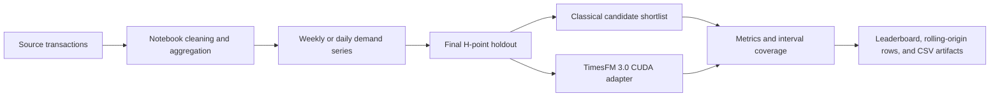

# Architecture and evaluation model

This project is a Windows-native tutorial and evaluation workspace for
univariate unit-demand forecasting. It compares a bounded classical shortlist
with a CUDA-only TimesFM 3.0 zero-shot baseline on the same time-ordered
holdout.

## System flow

The notebooks own source acquisition, cleaning, aggregation, plots, and
artifact writing. The `demand_forecast` package owns reusable forecast,
metric, and bake-off logic.

## Runtime boundary

`demand_forecast.timesfm_runner` is the only TimesFM integration point. It:

- Requires `torch.cuda.is_available()`; there is no CPU fallback.
- Reads `HF_TOKEN` from the process environment and does not persist it.
- Loads `google/timesfm-3.0-pytorch` once per process.
- Uses univariate history only, retains at most 15,360 recent points, and
  returns a median point forecast plus nine quantiles.

The project uses the TimesFM 3.0 weights only for non-commercial,
non-production work. See the root [README](../README.md) for the license
boundary.

## Baseline bake-off

`run_production_bakeoff` uses this sequence:

1. Sort the input series and reserve its final `h` observations as the test
   holdout.
2. Fit feasible seasonal-naive, Holt-Winters, and AutoARIMA candidates on the
   remaining history.
3. Optionally add the TimesFM 3.0 forecast.
4. Score the final holdout with MAE, RMSE, MAPE, sMAPE, MASE, bias, and
   interval coverage.
5. Build an inverse-validation-MAE ensemble when at least two candidates have
   validation scores.
6. Select the reported champion by final-holdout MASE and produce
   rolling-origin rows for the classical and TimesFM candidates.

The final holdout remains an evaluation artifact. It is useful for the
tutorial and result record, but it is not a production model-selection policy
for unseen future data.

## Extension modules

`demand_forecast.advanced` adds calendar features, optional hierarchy
aggregation, inventory-oriented scoring, and rolling summaries.
`demand_forecast.accuracy_push` adds hierarchy candidates and multi-window
selection. The extension notebook sources are not part of the current executed
TimesFM 3.0 baseline; re-run them before treating their output as evidence.

## Artifacts and history

- `data/results/` contains the current executed 01/02 production leaderboards.
- `notebooks/01_*` and `notebooks/02_*` contain the matching executed outputs.
- `docs/archive/` preserves older TimesFM 2.5 material and must not be read as
  TimesFM 3.0 performance.

For commands and incident handling, see the [operator runbook](runbook.md).
For callable contracts, see the [Python reference](reference.md).
